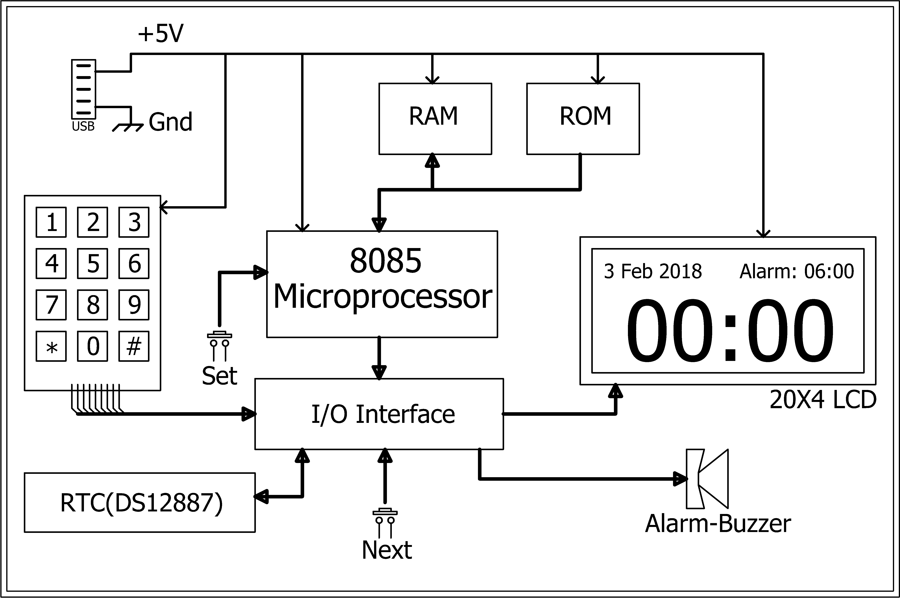
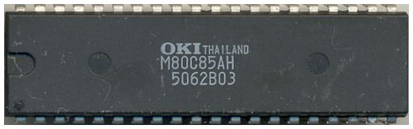

# Mathematical-Alarm-Clock
This device aims to make turning off an alarm a slightly more involving task, forcing the user to focus on the device for some time hence breaking the sleep. It will keep track of time using a RTC and will sound an alarm on the preset time and throw a randomly generated integer based mathematical problem at the user(+,-,/,*), the alarm will stop ringing as soon as the user enters the correct answer to the question. This projects will incorporate a display, a keypad, alarm sounding system(buzzer), and a RTC.


## NETAJI SUBHAS INSTITUTE OFTECHNOLOGY

## DIVISION OFELECTRONICS AND COMMUNICATIONENGINEERING

### EC316 MICROPROCESSORLABPROJECTREPORT

# Mathematical Alarm Clock

## ANINTEL8085 MICROPROCESSOR BASED PROJECT

### Submitted by

### Prabhat Gupta (124EC15)

### Srijan Pabbi (173EC15)

### Submitted to

### Prof. Dhananjay V. Gadre

### May, 2018


## Contents

- 1 Abstract
- 2 Background And Motivation
- 3 Justification
- 4 Block Diagram
- 5 Technical Details
   - 5.1 Hardware
      - 5.1.1 Core Microprocessor (Intel 80C85)
      - 5.1.2 Peripherals And Addressing
      - 5.1.3 RTC(Real Time Clock)
      - 5.1.4 20x4 Character LCD
      - 5.1.5 Key-Pad
      - 5.1.6 Buzzer
   - 5.2 Software Implementation and Interesting Concepts
      - 5.2.1 Big Font and LCD Posting Techniques
      - 5.2.2 Key-Pad Scanning
      - 5.2.3 LFSR(Linear Feedback Shift Register) Implementation
      - 5.2.4 User Setup Inputs With Interrupts
      - 5.2.5 Arithmetic Random Problem Generation With Result Check
- 6 Supporting Materials
   - 6.1 Support Links and References
   - 6.2 Project Schematic And Boards
   - 6.3 Bill of Materials


## 1 Abstract

Everyone must have seen the ordinary alarm clocks that sound only when it is set to be alarmed.Why not
to make a normal alarm period an interesting task. It’s time to get rid of the conventional alarm clocks.
Here what comes the mathematical alarm clock. The mathematical alarm clock is a device that modifies
a conventional alarm clock to a more advanced version that not only alarms but it also makes sure that
the user gets out of sleep for solving some mathematical problems.This device aims to make turning on an
alarm a slightly more involving task. It keeps the trackof time and displays it on the lcd. It does so by using
an RTC (parallel data bus). The Alarm can be set using a keypad. At the time of alarm, a buzzer sounds. The
buzzing of the alarm continues as long as the user would not give the correct answers of certain number of
mathematical problems. At the alarm preset time, the device throws a randomly generated integer based
mathematical problem based on simple arithmetic (+). The alarm stops only after the correct answer is
given by the user. The project incorporates a display (LCD 20x4),keypad, buzzer as an alarming system,
parallel bus RTC


## 2 Background And Motivation

EC-311/316 has provided us an opportunity to build this project under the able guidance of Prof Dhanan-
jay Gadre. The idea of this project is to learn and portray the skill of designing a microprocessor based
system and putting whatever we learn in this course into a useful application. This device aims to make
turning on an alarm a slightly more involving task, forcing the user to focus on the device for some time
hence successfully breaking the sleep as compared to normal alarm clocks. Making this project will involve
almost all the steps required for making a embedded system product namely; planning, designing, getting
the pcb fabricated, coding, and a making an enclosure for the final display, and most importantly docu-
menting throughout the process of making it, which will give us experience on how to design a embedded
product from zero to finish.

## 3 Justification

Mathematical Alarm Clock involves the use of a RTC(Real Time Clock) for time keeping, 20x4 character
LCD for display of time and the generated math questions, and a user input keypad, these devices cannot
be used with simple digital logic devices to perform the job we want out of this project. This project must
be able to display time and, perform background mathematical calculations , accept and compare user
inputs to the answers of the questions which it generated randomly. The need to do all this for successful
working of the project the use of a microprocessor which is fairly fast and can perform slightly complex
mathematical calculations is justified.


## 4 Block Diagram


```
Figure 1: Block Diagram of Mathematical Alarm Clock
```

## 5 Technical Details

##### „„„„„„„„„„„„„„„„„„„„„„„„„„„„

### 5.1 Hardware

#### 5.1.1 Core Microprocessor (Intel 80C85)

At the heart of this project is an Intel 80C85 microprocessor( _μ_ P) from OKI Semiconductors is a CMOS im-
plementation of the original TTL 8085 which has a quiescent current of as low as 10mA. The microprocessor
has a 64KB memory address space and 256 bytes of I/O space. In this case the 8085 is running at 3MHz
from the clock of a 6MHz crystal oscillator.


```
Figure 2: OKI 8085
```


#### 5.1.2 Peripherals And Addressing

This project employs a Atmel ROM 28C256, Intel 8155 PPI+RAM+Timer, Maxim DS12887 RTC, as periph-
erals for the microprocessor and hence they occupy some part of the 8085’s address space.

- Atmel ROM 28C256: Is a 32KB rom which is over kill for this project but was chosen due to its ready
    availability and most of the address space of the 8085 microprocessor is not in use.
    -The address space for the ROM ranges from 0000hto 0FFFh.
    -Chip Select(CS) for this IC is connected toA 15 of the _μ_ P
- Intel 8155: Is a IC specially developed to be used with the Intel 8085 _μ_ P. It has 256bytes of RAM, 3
    I/O ports 2 of 8bit and 1 of 6bit, with handshake capability using the former as I/O and the latter for
    handshaking, and a 8 bit timer with clock out.
    -The address space for the RAM ranges from 8000hto 80FFh.
    -The IO addresses for 8155CWR-00h, PORTA-01h, PORTB-02h, PORTC-03h
    -Chip Select(CS) for this IC is connected toA 15 of the _μ_ P
- RTC: This IC is a complete package of an RTC, battery, and crystal, along with a non-volatile RAM in
    the RTC. This chip implements the Intel Bus Protocol Internally and hence can be memory mapped.
    -The address space for the RTC ranges from 8100hto 8180h.
    -Chip Select(CS) for this IC is connected via a decoding logic as shown in Figure 7

#### 5.1.3 RTC(Real Time Clock)

The real time clock employed for this project DS12887A from Maxim Integrated is a parallel bus RTC with
data exchange via the Intel bus protocol implemented internally. This RTC comes in a 24 pin EDIP package
with internally implemented crystal oscillator and a battery. It can count time on both binary as well as
BCD format with one-time of the day alarm, and an added feature of daylight saving by keeping track
of the exact day,date,year,and century of the millennium. Alongside the basic time keeping features, it
can interrupt the processor about an alarm situation. It can also produce a square wave out of various
frequencies which can be used to drive an alarm sounding system.
The following is the schematic implementation of the RTC.


#### 5.1.4 20x4 Character LCD

The display used in our project is 20X4 LCD display. It is said so as it has 4 rows with 20 characters each.
It uses HD44780 driver. The customized characters are generated using CGRAM. 7 special characters are
stored at seven locations of CGRAM. Using these seven characters any of the character or digit can be
produced. Its contrast and brightness are controlled using two independent presets.

#### 5.1.5 Key-Pad

The keypad used is 4X3 that means it has 4 rows and 3 columns. The switches that are used in the keypad
matrix is 40XX tactile switches. It is interfaced using polling technique. In the polling technique, each
switch press is detected by polling individual switches. In this, rows are treated as input and columns as
output. A switch is identified by outputting through columns and inputting through rows.

#### 5.1.6 Buzzer

The buzzer used here is the D.C. buzzer. It is derived through a port pin of 8155 using a transistor as a
switch.


### 5.2 Software Implementation and Interesting Concepts

#### 5.2.1 Big Font and LCD Posting Techniques

Big Font or customized characters are generated using the CGRAM of the lcd. For generating these char-
acters, some special patterns(7) are stored in the CGRAM. Using these seven patterns, by appropriate
positioning, any big character can be generated.

```
(a) Decimal Digits In Bigfont
```


```
(b) Building Blocks For The Digits
```
- In order to initialize the LCD the following set of commands need to be sent on the LCD port using
    the command function explained later. The first command is used to set the LCD into the 8 bit
    data acceptance mode along with a 2 line spill over, which means that if the first line is filled with
    characters, the next character sent will be automatically printed in the next line. The second command
    clears the LCD of any previous garbage value. Next comes the display on command and the cursor
    mode determination. At the end the entry mode is specifier which determines the movement of data
    or the cursor on the data input to the LCD.
1 LCD_INIT : MVI C, 3 8 h ; 8 b i t 2 l i n e mode
2 CALL SEND_CMD
3 MVI C, 0 1 h ; c l e a r l c d
4 CALL SEND_CMD
5 MVI C , 0 Ch ; d i s p l a y on , c u r s o r o f f , b l i n k o f f
6 CALL SEND_CMD
7 MVI C, 0 6 h ; e n t r y mode
8 CALL SEND_CMD
9 RET
10
- The following are two subroutines which are used to send either data or commands to the LCD
    display. Both of them follow a strict protocol in which first the data or command word is made
    available on the PORTB lines of the 8155. The protocol next requires the LCDRS to be either high or
    low depending on the type of word, data or command. Next a pulse of LCDEN is required for the
    LCD controller to take in the data after which a delay is given to perform the operation successfully
    without any interference.
1 SEND_DATA : PUSH PSW ; C f o r a r g
2 MOV A, C ;DATA OUT
3 OUT PORTB
4 IN PORTA


5 ORI LCDRS ; f o r making r s 1
6 OUT PORTA ; s e n d i n g r s b e f o r e l c d _ e n
7 ORI LCDEN ; EN p u l s e
8 OUT PORTA
9 ANI 0FBh
10 OUT PORTA
11 CALL DELAY_2MS
12 POP PSW
13 RET
14
15 SEND_CMD : PUSH PSW ; C f o r a r g
16 MOV A, C ;COMMAND OUT
17 OUT PORTB
18 IN PORTA
19 ANI 0FDh ; f o r making r s 0
20 OUT PORTA ; s e n d i n g r s b e f o r e l c d _ e n
21 ORI LCDEN ; EN p u l s e
22 OUT PORTA
23 ANI 0FBh
24 OUT PORTA
25 CALL DELAY_2MS
26 POP PSW
27 RET
28


#### 5.2.2 Key-Pad Scanning

```
Figure 4: Connections To port A and C
```
```
It is interfaced using polling technique. In the polling tech-
nique, each switch press is detected by polling individual
switches. In this, rows are treated as input and columns
as output. A switch is identified by outputting through
columns and inputting through rows.
```
1
2 KEYPAD : PUSH PSW
3 PUSH H
4 COL1 : IN PORTA ; i n p u t c u r r e n t s t a t e o f portA
5 ANI 0 F7h ; make t h e K_5 b i t a s 0 t o r e a d i n p u t s f o r c o l 1 o n l y
6 OUT PORTA
7 CALL DELAY_2MS ; debouncing d e l a y
8 IN PORTC ; r e a d t h e column
9 ANI 0Fh
10 PRES1 : CPI 0Eh ; i s b u t t o n i n row 1 p r e s s e d?
11 JNZ PRES
12 MVI A, 0 1 h
13 JMP ENDKEYPAD
14 PRES4 : CPI 0Dh ; i s b u t t o n i n row 2 p r e s s e d?
15 JNZ PRES
16 MVI A, 0 4 h
17 JMP ENDKEYPAD
18 PRES7 : CPI 0Bh ; i s b u t t o n i n row 3 p r e s s e d?
19 JNZ PRESS
20 MVI A, 0 7 h
21 JMP ENDKEYPAD
22 PRESS10 : CPI 07 h ; i s b u t t o n i n row 4 p r e s s e d?
23 JNZ COL
24 MVI A, 0 Ah
25 JMP ENDKEYPAD
26
27 COL2 :...
28
29 COL3 :...
30
31 ENDKEYPAD :
32 CPI 0Fh ; i s no b u t t o n p r e s s e d?
33 JZ COL1 ; i f t h a t i s t h e c a s e t h e n c o n t i n u e p o l l i n g
34 LXI H, PRESSED
35 MOV M, A ; s t o r e t h e p r e s s e d
36 CALL DELAY_500MS
37 IN PORTA
38 ORI 38 h make t h e K_5 , 6 , 7 i n a c t i v e
39 OUT PORTA
40 POP H
41 POP PSW
42 RET
43


Figure 5: Keypad Scanning Algorithm Flowchart


#### 5.2.3 LFSR(Linear Feedback Shift Register) Implementation

```
Figure 6: Flowchart of LFSR Algorithm
```
```
It is an algorithm to generate random numbers. In this
method we have two components- seed and mask. Algo-
rithm goes this way: seed value is masked using mask value
such that the bits in seed, corresponding to the ones in mask
value, are XORed and the resultant is moved to the MSB of
seed and the other bits are shifted one to left. In this way we
generate a random number each time this cycle is repeated.
1 LFSR : PUSH PSW ; RET VAL IN THE SEED LOC
2 PUSH B
3 PUSH D
4 PUSH H
5 LXI H, SEED
6 MOV A,M ; r e t r i e v e s e e d
7 LXI H, BITS
8 ANA M ; r e t r i e v e mask b i t s
9 MVI B , 0 0H ; c o u n t
10 MVI C, 0 8H ; 8 b i t s
11 LOOP1 : RRC ; LSB i n CARRY
12 JNC NXT
13 INR B ; i n c r e m e n t B i s c a r r y i s 1
14 NXT1 : DCR C
15 JNZ LOOP
16 MOV A, B
17 RLC
18 RLC
19 RLC
20 RLC
21 RLC
22 RLC
23 RLC
24 ANI 80H
25 MOV B , A ; s t o r e t h e XOR r e s u l t
26 ; i n t h e MSB o f B
27 LXI H, SEED
28 MOV A,M
29 STC
30 CMC
31 RAR ; r o t a t e SEED making MSB=
32 ORA B ; put t h e new MSB v a l from B
33 STA SEED ; r e p l a c e o l d s e e d
34 ; v a l with new rand no.
35 POP H
36 POP D
37 POP B
38 POP PSW
39 RET
```

#### 5.2.4 User Setup Inputs With Interrupts

Interrupt RST7.5 is used as an user interface to update the timings of normal day time and the alarm time.
It’s a user interacting switch which is connected to RST7.5. Each time this switch is pressed, program
transfers to settings window to set either day time or alarm time. According to the option selected, settings
transfer to set the required time.

#### 5.2.5 Arithmetic Random Problem Generation With Result Check

Each time alarm time matches the regular time, program transfers to a section in which some random
problems(based on addition) are generated using LFSR algorithm. The result to these problems are also
calculated and stored n the memory at the same time. The results are checked against the ones that are
inputted by the user. Only when the result matches the input the alarm goes off otherwise more random
problems are generated.


## 6 Supporting Materials

##### „„„„„„„„„„„„„„„„„„„„„„„„„„„„

### 6.1 Support Links and References

- Youtube Video: https://www.youtube.com/watch?v=FnkgJ6MPxQ
- GITHUB Link for Code: https://github.com/srijanpabbi/Mathematical-Alarm-Clock-8085-uP-based
- Programmer and Assembler related Material: https://drive.google.com/drive/folders/0B3dkOo5f1Sb-
    ZHQ5bHRYb3ZnR2c?usp=sharing
- Other 8085 Projects for Reference: [http://www.8085projects.in/](http://www.8085projects.in/)
- A forum discussion on LCD bigfont: https://www.avrfreaks.net/forum/alphanumeric-lcd-hd44780-
    big-font-big-digits-generator-excel-sheet
- Full End to End character LCD tutorial in C as well as Assembly Language
- RTC Datasheet: https://pdfserv.maximintegrated.com/en/ds/DS12885-DS12C887A.pdf
- OKI 80C85 Datasheet: [http://elearning.tukenya.ac.ke/course/view.php?id=](http://elearning.tukenya.ac.ke/course/view.php?id=)
- LCD Controller Datasheet: https://www.sparkfun.com/datasheets/LCD/HD44780.pdf


### 6.2 Project Schematic And Boards

```
Figure 7: Logic Board Schematic
```

```
Figure 8: Logic Board Layout
```
Figure 9: User Interface Board Schematic


```
Figure 10: User Interface Board Layout
```
### 6.3 Bill of Materials


